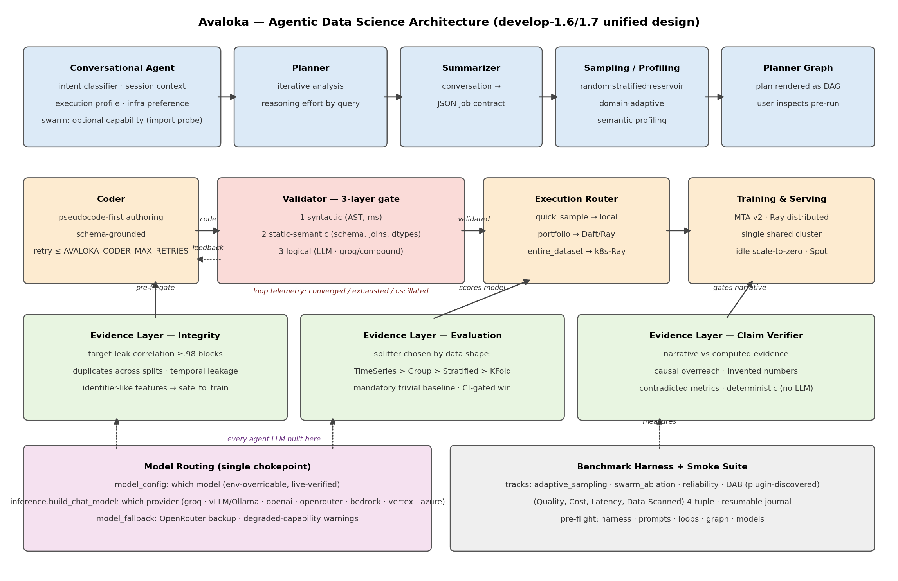
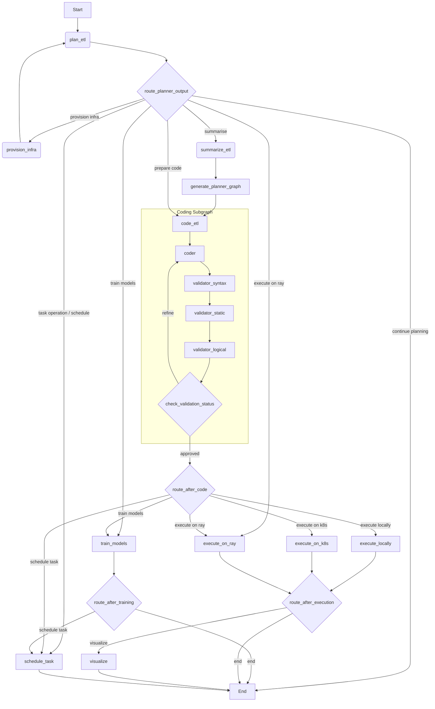
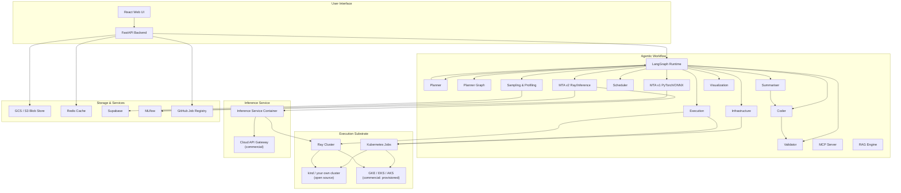

# Avaloka

[](CHANGELOG.md)
[](LICENSE)
[](https://www.ray.io/)
[](https://github.com/langchain-ai/langgraph)

> **An agentic team of data scientists that takes any dataset from raw data to
> model inference — using AI.**

Avaloka is a [LangGraph](https://github.com/langchain-ai/langgraph)-powered team
of specialized agents you direct in plain language. Point it at a dataset and it
will **sample and profile** the data, **plan** an analysis, **write and
validate** the Python to carry it out, **execute** that code locally or on a
distributed [Ray](https://www.ray.io/) cluster, **train** a model, **serve** it
for inference, and **persist** every artifact along the way. One chat session
can go from a raw CSV to a deployed model endpoint — with a human in the loop at
each decision.

**New here?** Three links, in the order most people want them:

1. 📦 **[Install it](docs/INSTALL.md)** — one command, or fully offline.
2. 🚶 **[Walk through it](docs/USER_GUIDE.md)** — sign in, upload, ask, train.
3. 🗺️ **[Understand it](docs/architecture.md)** — the agent team and the request lifecycle.

---

## Quickstart

Five minutes, on your own machine, no cloud account.

```bash
git clone https://github.com/guruvaidev/avaloka.git && cd avaloka
./scripts/install.sh                 # creates .venv, installs deps, prints an edition report
```

Give it one model key — any provider — and start the API:

```bash
export GROQ_API_KEY="<your key>"     # or OPENAI_API_KEY / OPENROUTER_API_KEY / a local Ollama
uvicorn app.api.server:app --port 9000
curl localhost:9000/health
```

Then upload something and ask a question:

```bash
curl -F "file=@sales.csv" localhost:9000/api/upload
```

> **Port 9000, not 8000.** The container image serves on 9000 and the Helm
> service exposes it on 9000. Uvicorn's own default is 8000, which is the single
> most common reason a fresh install "cannot reach the API" — pass `--port 9000`
> and every path lines up.

Prefer a cluster, a UI, or no internet at all? That is all in the
**[Install Guide](docs/INSTALL.md)** — including
[running Avaloka completely offline](docs/INSTALL.md#running-avaloka-completely-offline)
with a `--network none` check so you can prove it rather than trust it.

**Something not working?** The install guide's
[First run: what to expect, and what goes wrong](docs/INSTALL.md#first-run-what-to-expect-and-what-goes-wrong)
section lists every failure we hit bringing this stack up on a clean cluster.
Each one is silent — the symptom never names the cause — so it is worth a read
before you start debugging.

### Two ways to run it

| | |
| --- | --- |
| **Run it yourself, fully offline** | [**Install Guide → Running Avaloka completely offline**](docs/INSTALL.md#running-avaloka-completely-offline). No internet at all: a local model server, the embedding model **baked into the image**, and storage, memory and auth all deployed by the chart. Nothing calls home. |
| **Let us run it** | [**avaloka.ai**](https://avaloka.ai) hosts the **Professional** and **Enterprise** editions with auto-scaling compute — no Kubernetes, Ray, object store or model provider to stand up. Enterprise adds shared team workspaces, the cloud scheduler, and connections to your own cloud clusters. |

The open-source edition is not a limited trial of the hosted ones. It is the
same engine on your own hardware, and it stays useful with no account, no key
and no network.

Under the hood, a Planner agent acts as the team lead: it converses with you and
delegates to Sampling, Profiling, Coder, Validator, Execution, Data-Transfer,
Model-Training, and Visualization specialists, all coordinating through one
shared state object. Generated code is authored pseudocode-first and passes a
three-layer validation gate, so it stays grounded in the source schema even when
the primary LLM is unavailable.

---

## Built on proven open source

Avaloka is an orchestration layer, not a reimplementation. The heavy lifting —
distributed execution, storage, vector search, experiment tracking, the
database — is done by mature, widely deployed projects that were load-bearing
in production long before Avaloka existed. What Avaloka adds is the agent team,
the evidence layer and the conversation; what it deliberately does **not** add
is a homegrown substitute for any of the following.

| Layer | We use | Rather than |
| --- | --- | --- |
| Distributed compute | [Apache Ray](https://www.ray.io/) + [KubeRay](https://github.com/ray-project/kuberay), [Apache Spark](https://spark.apache.org/), [Apache Arrow](https://arrow.apache.org/), [Daft](https://github.com/Eventual-Inc/Daft) | our own scheduler |
| Relational storage | [PostgreSQL](https://www.postgresql.org/) | our own store |
| Object storage | [MinIO](https://min.io/) (S3 API), [Apache Parquet](https://parquet.apache.org/), [Delta Lake](https://delta.io/), [Apache Iceberg](https://iceberg.apache.org/), [Apache Avro](https://avro.apache.org/) | a bespoke artifact format |
| Vector search / memory | [Chroma](https://www.trychroma.com/), [Milvus](https://milvus.io/), [Redis](https://redis.io/) | our own index |
| ML training & tracking | [PyTorch](https://pytorch.org/), [scikit-learn](https://scikit-learn.org/), [ONNX](https://onnx.ai/), [MLflow](https://mlflow.org/) | our own AutoML |
| Agent runtime | [LangGraph](https://github.com/langchain-ai/langgraph) / [LangChain](https://github.com/langchain-ai/langchain), [Model Context Protocol](https://modelcontextprotocol.io/) | a proprietary agent protocol |
| Orchestration | [Kubernetes](https://kubernetes.io/), [Helm](https://helm.sh/), [kind](https://kind.sigs.k8s.io/) | our own deployment system |
| API & scheduling | [FastAPI](https://fastapi.tiangolo.com/), [Uvicorn](https://www.uvicorn.org/), [Pydantic](https://pydantic.dev/), [Celery](https://docs.celeryq.dev/) + [RedBeat](https://github.com/sibson/redbeat) | our own web and job stack |
| Auth & app data | [Supabase](https://supabase.com/) ([GoTrue](https://github.com/supabase/gotrue), [PostgREST](https://postgrest.org/), [Kong](https://konghq.com/)) | our own identity system |
| Data engine | [pandas](https://pandas.pydata.org/), [NumPy](https://numpy.org/), [DuckDB](https://duckdb.org/), [SQLAlchemy](https://www.sqlalchemy.org/) | our own dataframe |

Every one of these is independently maintained, independently released and
independently audited by communities far larger than ours. When Avaloka reports
a number, the computation underneath it was performed by software that has been
vetted by many more eyes than a single vendor could bring — and you can verify
any of it yourself, because none of it is hidden behind our abstraction.

The full per-project attribution, with licences, is in
[Acknowledgements](#acknowledgements) and [NOTICE](NOTICE).

---

## Documentation

Everything below is in this repository. Start wherever your question is.

### Getting started

| Guide | What's in it |
| ----- | ------------ |
| 📦 **[Install Guide](docs/INSTALL.md)** | **Start here to run it.** Requirements, one-command install, Kubernetes vs. local processes, offline and air-gapped, and what goes wrong on a first run. |
| 🚶 [User Guide](docs/USER_GUIDE.md) · [PDF](docs/Avaloka-AI-1.0-User-Guide.pdf) | A hands-on walkthrough: sign in, upload, prompt, connect a database, train a model. |
| 🔧 [Technical User Guide](docs/TECHNICAL_USER_GUIDE.md) · [PDF](docs/Avaloka-AI-1.0-Technical-User-Guide.pdf) | Every capability, the prompts that invoke it, supported formats, endpoints and edition gates. |
| 💻 [CLI Guide](README_CLI.md) | **The `avaloka` command** — analyse a file, train a model, chat about a dataset, all from a terminal. |
| 🧭 [Mission planner & MCP](docs/cli.md) | A separate planning-only interface (`python -m app.interfaces.cli.main`) that prices and routes a workload without running it, plus the MCP server. |

### Running it for real

| Guide | What's in it |
| ----- | ------------ |
| ☸️ [Kubernetes Deployment](docs/deployment.md) | `kind` and small self-managed clusters, with Ray & KubeRay, the Helm chart, and how to verify a deployment. |
| 🛠️ [Operations](docs/operations.md) | Running it beyond a first try — MLflow tracking, artifact storage, inference, and troubleshooting. |
| 🌐 [HTTP API](docs/api.md) | The FastAPI surface — upload → chat → assets → models. |
| 📌 [Version Matrix](docs/versions.md) | The single source of truth for pinned versions (Python, Ray, Daft, images). |

### Understanding it

| Guide | What's in it |
| ----- | ------------ |
| 🗺️ [Architecture](docs/architecture.md) | The agent team, the request lifecycle, and why each dependency exists. |
| 📄 [Research Paper](docs/Avaloka-Research-Paper.pdf) | The system's design and evaluation, written up. |
| 🧪 [Testing](docs/testing.md) | Test tiers, markers, the suite reference, and how to run each. |
| 📊 [Test Reports](docs/test-reports/) | Per-case evidence behind the claims in [How this is proven](#how-this-is-proven-and-where-the-proof-is-thin). |
| 🧭 [Design Notes](docs/design/) | Where the system is heading: agent experience, the loop & graph engine, telemetry. |

### Editions, licensing and contributing

| Guide | What's in it |
| ----- | ------------ |
| 🏷️ [Editions](docs/EDITIONS.md) | What Open Source / Free / Professional / Enterprise each include, and why each boundary exists. |
| 🤝 [Contributing](CONTRIBUTING.md) | Development setup, coding conventions, testing tiers, PR workflow. |
| 🔒 [Security Policy](SECURITY.md) | How to report a vulnerability privately. |
| 📜 [Code of Conduct](CODE_OF_CONDUCT.md) | Community standards. |
| 📝 [Changelog](CHANGELOG.md) | What changed, release by release. |

Avaloka is open source under the [Apache License 2.0](#license).

---

## Preface — Realizing the Fourth Paradigm

<p align="center">
  
  <br>
  <em>Jim Gray (1944–2007), Turing Award laureate, and <strong>The Fourth Paradigm: Data-Intensive Scientific Discovery</strong> (Microsoft Research, 2009).</em>
</p>

In a January 2007 lecture — his last before he was lost at sea — the database
pioneer **Jim Gray** described a **fourth paradigm** of science. The first three
were **empirical** observation, **theoretical** models, and **computational**
simulation. The fourth is **data-intensive discovery**: science conducted by
exploring and analyzing vast, messy data. Gray's dream was not more data for its
own sake — it was to give scientists **effective tools** so they could spend
their time on questions and discovery instead of on the plumbing of capturing,
cleaning, moving, and analyzing data. That dream is collected in the book that
bears his idea's name, published in his honor.

Two decades on, most of the plumbing is still there — cloud accounts, clusters,
data pipelines, schema wrangling, visualization boilerplate, statistical setup —
and it still stands between a curious person and an answer.

**Avaloka is built to remove that cruft.** Drawing on decades of data-engineering
and data-science experience, it is an **AI-native data OS for ETL, ML, and
experimentation** — deliberately **not code-first**, and **not another chatbot
code generator**. It is **analysis-first** and **model- and inference-first**:
you lead with the question, and the AI builds the scaffolding beneath it — the
cloud and Kubernetes, the data pipelines, the visualization, and the statistical
analysis — so a raw dataset becomes clean data, **actionable intelligence (not
just charts)**, a trained model, and a served prediction.

That is Gray's dream, made practical by **a team of AI agents that work like a
data science team** — so the scientist, the analyst, and the curious can stay
with the science.

## Why a model alone does not solve this

Upload a spreadsheet to Claude or ChatGPT and you get a genuinely useful
answer about that spreadsheet. In an enterprise the interesting facts are not
in one spreadsheet. They are spread across an operational database, a
warehouse, an object store and a document store, and the question worth asking
is almost always a cross-correlation between them — the churn number next to
the support history next to the billing record. A file you can upload is
already the answer to a much smaller question than the one you have.

**An agentic application is necessary but still not sufficient.** An agent that
writes and runs code against your systems removes the copy-paste step, which is
real progress. It does not, by itself, tell you whether the answer is right. An
agent that silently samples the first thousand rows, or leaks the target into
its own features, or agrees with you when you push back on a number, is more
dangerous than a spreadsheet — it is wrong at machine speed, fluently, with
supporting prose.

Three things have to hold at once, and it is the combination that is hard:

**Connected, not uploaded.** The agent reaches the systems where the facts
already live — PostgreSQL, MongoDB, DuckDB, SQLite, S3/GCS, warehouses — and
joins across them. Data flows, not data files, are what business processes
actually look like.

**Conversational, because analysis is a conversation.** The first question is
never the real one. "Why are people leaving?" becomes a question about tenure,
then about support tickets, then about one plan tier. A system that answers
once and stops has not done the job; a system that asks which of two readings
you meant, and says when the evidence contradicts you, has.

**Verified, because fluent and correct are different properties.** Avaloka runs
its own checks against its own work: integrity checks for leakage and
train/test contamination, a mandatory baseline every model must beat before it
is reported as good, and a claim verifier that checks the prose against the
computed evidence. When a result does not hold, the system says so. That is the
part a model cannot supply on its own, because a model has no privileged access
to whether its own answer is true.

Transparency is the thread through all three: every number is traceable to the
query that produced it, every sample says it is a sample, and every claim is
checkable.

### The model is the smallest part

The industry position is that the best model is not sufficient for enterprise
work, and that what actually decides the outcome is the **harness**, the
**learning loop** and the **knowledge graph** around it. We agree, and the
reason is measurable rather than rhetorical: swap the model underneath a weak
harness and the answers change; swap the model underneath a strong one and the
*errors* change but the guarantees do not.

**The harness** is what stands between a fluent answer and a true one. In
Avaloka it is not a wrapper around a prompt — it is an execution graph with
checks that can stop it: integrity checks that refuse to train on leaked or
contaminated data, a baseline every model must beat before it is reported as
good, optimizer-aware validation of generated queries before they run, and a
claim verifier that checks the prose against the computed evidence rather than
against the model's own narration. A model cannot supply any of this, because a
model has no privileged access to whether its own answer is true.

**The knowledge graph** is what makes an answer traceable and a question
answerable across systems. Avaloka records nodes and edges for datasets,
columns, transformations and derived artifacts, so a claim resolves back
through its lineage to the rows that produced it — and so a question like
"where did this PII end up" has an answer that is computed rather than
remembered.

**The learning loop** is what makes the second analysis cheaper than the first:
episodic memory over past queries, retrieved by similarity, plus stated
preferences that persist across a session and style hints that shape generated
code. This is the youngest of the three, and the section below says plainly
where it stands.

None of these three is a model feature. All three are the product.

### How this is proven, and where the proof is thin

We would rather publish the gaps than claim three pillars and evidence one.

| Pillar | What is measured | Standing |
| --- | --- | --- |
| **Harness** | 16 executed test cases covering leakage, duplicate-split detection, identifier-like features, the mandatory baseline, invented-number detection, and the scorer's own resistance to gaming | **Strongest.** Most of the evidence layer is verified end to end against a live deployment |
| **Knowledge graph** | 2 executed cases: ancestry recorded across derivations, and PII located *through* lineage rather than by re-scanning | **Real but thinly covered.** The store exists and the cases pass; the coverage is 2 cases, not 20 |
| **Learning loop** | Deployed and verified recalling across a pod restart (`3.4s` cold with hints already present, `0.6s` warm) | **Runs.** It carries context forward — episodic memory, stated preferences, style hints — so later work has something to build on. We do not claim it makes analyses measurably better; that is not what it is there for yet |

The honest summary is that Avaloka today is a **strong harness, a real graph,
and a working learning loop whose value is still ahead of it**. Anyone
evaluating the three-pillar claim should weight it that way, and the
[test report](docs/test-reports/) contains the per-case evidence for each row
above, including which cases are blocked and on what.

On the loop specifically: it is deployed, it persists across restarts, and it
retrieves what earlier turns established. That is the point of it today — to
hold context so that memory-aware behaviour has somewhere to live. **We are not
claiming it makes analyses measurably better, and we have not measured that.**
It is foundation, not a result, and we would rather say so than dress a
scaffold up as an outcome.

### Tested, not asserted

Avaloka is evaluated against external and internal benchmarks rather than
described in adjectives:

* **DataAgentBench (DAB)** — the UC Berkeley agentic data-analysis benchmark:
  54 queries over 17 datasets spanning PostgreSQL, MongoDB, SQLite and DuckDB,
  graded by the official per-query validators. Run against the unmodified
  upstream scaffold.
* **Conversational integrity** — sycophancy resistance, evidence fidelity under
  social pressure, honest delivery of bad news, and ambiguity handling, each
  bracketed by scripted faithful and sycophantic reference systems so the
  numbers have a floor and a ceiling rather than floating free.
* **Adaptive sampling, swarm ablation, reliability, and a model matrix** — what
  each agent contributes, what sampling costs in accuracy, how the system
  behaves under injected faults, and how much conversational integrity the
  cheap model tier gives up.

Current results, their bounds, and the places the system is weakest are in
`docs/` and in the research paper. Where a number is not yet measured it is
marked unmeasured rather than estimated.

---

## Editions

This repository **is** the open-source edition. Everything here is Apache 2.0
and yours to run.

```bash
./scripts/install.sh          # open source
./scripts/install.sh --check  # what does my install actually allow?
```

| | **Open Source** | **Free** | **Professional** | **Enterprise** |
| --- | --- | --- | --- | --- |
| Runs on | your infrastructure | Avaloka cloud | your cloud, your billing | your cloud, your billing |
| Analysis, codegen, visualization | ● | ● | ● | ● |
| Export the generated code | ● | ● | ● | ● |
| Ray, scheduler, batch jobs | **●** | ○ | ● | ● |
| Model training, registry, inference serving | **●** | ○ | ● | ● |
| Cloud / database connectors | ○ | ○ | ● | ● |
| Provisioning & scheduling onto a cloud cluster | ○ | ○ | ● | ● |
| Teams, sharing, comments, notifications | ○ | ○ | ○ | ● |

Two things people reasonably expect to be different:

**Self-hosted open source has the scheduler and distributed Ray execution.**
It is your cluster and your bill, so we do not cap it. The Free *hosted* tier
does not, because we pay for those cycles. Same code — the difference is who
is paying.

**Generated code is yours in every edition, Free included.** It is your work
product; review it and run it at your own discretion, as you would any code.

Commercial capabilities are not flags you can flip — they live in a separate
package that an open-source install never pulls. Full detail, including how
offline licence verification works for air-gapped deployments, is in
[docs/EDITIONS.md](docs/EDITIONS.md).

### Where it runs, and what you licensed

Two independent questions decide what you get, and collapsing them is the usual
source of confusion:

| Question | Values | Decides |
| --- | --- | --- |
| **Where does it run?** | self-hosted · Avaloka-hosted | who pays for the compute |
| **What did you buy?** | OSS · Free · Professional · Enterprise | which capabilities are licensed |

This is why *"does the free version have a scheduler?"* has no single answer.
**Self-hosted open source: yes** — it is your cluster and your bill.
**Free on Avaloka's cloud: no** — we pay for every scheduled cycle. Same code,
opposite answer; the difference is who is paying.

A capability is unavailable for exactly one of three reasons, and every gate
declares which (`GATE_REASON` in `app/core/editions.py`):

| Reason | Meaning | Workaround |
| --- | --- | --- |
| `OPEN` | Not gated | Nothing to work around |
| `COST` | We provide the compute, so hosted plans are capped | **Self-host** — then it is your bill |
| `COMMERCIAL` | The implementation is not in the OSS distribution | None; the code is not on disk |

A capability disabled in a self-hosted OSS install for a `COST` reason is a bug.
The boundary is enforced by **import probe**, not configuration — no environment
variable can claim a capability whose module is absent — which is what makes the
split honest rather than advisory. See [docs/EDITIONS.md](docs/EDITIONS.md).

```bash
./scripts/install.sh                 # open source
./scripts/install.sh --check         # what does my install resolve to?
./scripts/install.sh --edition professional --license-key "$KEY"
```

#### What the open-source edition is sized for

**A laptop, or a small Kubernetes cluster you run yourself.** That is the
target, it is what gets tested, and it is what the capability matrix grants.
Everything below follows from it.

| | |
| --- | --- |
| **Tested on** | macOS and Linux laptops; a single-node `kind` cluster; small self-managed clusters |
| **Not tested on** | large multi-node clusters, autoscaling node pools, multi-tenant or production workloads |
| **Support** | community, best-effort. You run it at your own risk. |

If you need scale — provisioned and autoscaled clusters, larger distributed
jobs, scheduled cloud workloads, SLAs — that is what the commercial editions
are for. See [avaloka.ai](https://avaloka.ai), or email
**[support@avaloka.ai](mailto:support@avaloka.ai)**.

**Included, and fully functional**

- The whole analysis path — profile, transform, analyse, visualise
- **Distributed Ray execution on a cluster you already run**, and the local
  scheduler (Celery + Redis via `docker-compose.scheduler.yml`). These are not
  capped: it is your cluster and your bill, so capping them would protect
  nothing. They are *sized* for a small cluster, not *limited* to one.
- Model training and inference locally
- The generated code, always. Whatever Avaloka writes, you can export and run in
  your own environment. There is no black box.
- File connectors: CSV, TSV, JSON, XML, Excel, Parquet, Avro, Delta, Iceberg
- Any model provider, including local models

**Not included**

- **Cloud infrastructure provisioning.** Avaloka will not create a GKE, EKS or
  AKS cluster for you. `get_provider("gcp"|"aws"|"azure")` refuses in an
  open-source build and tells you where to go. This is a genuine limitation,
  not a switch: standing up and paying for cloud infrastructure on your behalf
  is what the commercial editions do.
- **Scheduling work onto a cloud cluster.** The scheduler runs locally and
  schedules local and own-cluster work. What it cannot do is dispatch a job to
  a managed cluster it did not provision.
- **Scheduling a training run onto a cloud cluster.** MTA itself is yours —
  train and serve models locally or on your own Ray cluster, with MLflow
  tracking and the model registry. What is commercial is dispatching that work
  to managed cloud infrastructure Avaloka provisioned for you.
- **Scale operations** — autoscaling policy, node-pool management, cost
  controls, multi-tenant isolation.
- **Team features** — shared analyses, comments, notifications, SSO and audit.

> **What "connect" still does.** Avaloka can attach to any cluster your
> `kubeconfig` already reaches, including a cloud one you provisioned yourself,
> and run distributed Ray and scheduled jobs on it. The commercial line is
> Avaloka *creating and managing* that infrastructure for you — not whether
> your cluster happens to sit in a cloud.

##### With a commercial edition

Point Avaloka at any cloud and let it run there: provisioned and autoscaled
clusters, larger distributed execution, scheduled jobs on that cluster, and
delivery of the results. Teams share analyses, comment on them, and work from
the same connections and schedules.

The Enterprise UI adds the configuration surfaces for that — cloud Kubernetes
connections and scheduler configuration — which the open-source edition has no
use for, because it has no cloud cluster to point them at.

See [docs/EDITIONS.md](docs/EDITIONS.md) for the capability-by-capability
breakdown, and run `./scripts/install.sh --check` to see what your install
resolves to.

---

## Agent Roster

| Agent | Responsibility |
| ----- | -------------- |
| **Planner (`planner.py`)** | Conducts iterative analysis by conversing with the user and orchestrating other agents (Sampling, Coder, Validator) to provide analytical inputs and insights. It decides the next action, such as continuing the analysis, summarizing the plan, provisioning infrastructure, or handing off to the execution workflow. |
| **Planner Graph (`planner_graph_agent.py`)** | Builds a mermaid-compatible DAG so users can visualise the plan. |
| **Summariser (`summarizer.py`)** | Converts the conversational plan into a structured JSON contract for downstream agents. |
| **Infrastructure (`infra_agent.py`)** | Provisions and connects Kubernetes infrastructure through `k8s_invoker.py`. Open source provisions `local` (kind) and connects to any cluster your kubeconfig reaches; provisioning managed GKE/EKS/AKS is a commercial capability and is refused in an OSS build. |
| **Coder (`coder.py`)** | Generates pseudocode, then produces executable Python. Falls back to deterministic scripts if Groq is unavailable or validation repeatedly fails. |
| **Validator (`validator.py`)** | Runs syntax, static-semantic, and logical checks; attaches previews of the produced DataFrame to the agent state. |
| **Execution (`execution_agent.py`)** | Executes locally, on a Kubernetes job, or on a Ray cluster (`execute_on_ray`), capturing stdout/stderr and output artefacts. |
| **Sampling (`sampling_agent.py`, `sampling_agent_v2.py`, `sampling_agent_daft.py`)** | Supplies quick dataset samples and Daft-powered portfolio samples with per-column statistics for exploratory tasks. |
| **Sampling Async (`sampling_async.py`)** | Lightweight async helper for quick single-pass sampling, used by the FastAPI server. |
| **Sampling Persistence (`sampling_persistence.py`)** | Caches full-profile results in Supabase so repeated requests skip recomputation. |
| **Profiling (`profiling_agent.py`)** | Semantic data analysis: infers domain, ranks columns by predictive power, flags quality issues. Two entry-points: `profile_quick()` (fast, LLM calls 1–2) and `profile_full()` (all insights). |
| **Data Transfer Agent (`data_transfer_agent/`)** | Generates, validates, and executes Daft-based ETL code for cross-format transfers (CSV, Parquet, Avro, Delta, Iceberg, JSON, XML, Excel). |
| **Model Training Agent v1 (`model_training_agent.py` + `mta/`)** | Autonomous ML training with PyTorch, ONNX export, and MLflow experiment tracking. |
| **Model Training Agent v2 (`mta_v2/`)** | Distributed training on Ray, containerized inference service deployment, and the MLflow model registry — all open source, on your own cluster. Scheduling a run onto a cloud cluster Avaloka provisioned, with a managed API gateway, is commercial. |
| **Visualization (`visualization_agent.py`)** | Creates insightful visualizations using Python (Matplotlib, Seaborn). |
| **Scheduler (`scheduler.py`)** | Schedules periodic runs, reports status, retrieves past results, and cancels tasks via Celery/RedBeat. |
| **Conversational (`avaloka_agent/`)** | Reasoning-led dialogue: classifies intent, resolves execution profile and infra preference, carries session context across turns, and discovers datasets natively. Swarm narration is an optional capability — absent builds degrade to no narration rather than failing. |
| **Integrity (`integrity_agent.py`)** | Screens for target leakage (correlation ≥.98 blocks), duplicate rows across splits, identifier-like features, and temporal leakage **before** a model is fit. Reports `safe_to_train`. |
| **Evaluation (`evaluation_agent.py`)** | Cross-validates with the splitter the data requires (`TimeSeriesSplit` > `GroupKFold` > `StratifiedKFold` > `KFold`, reason recorded) and scores every model against a mandatory trivial baseline; "beats baseline" requires clearing fold-to-fold noise, not a higher mean. |
| **Claim Verifier (`claim_verifier.py`)** | Checks the *narrative* against the computed evidence: causal overreach, invented numbers, metric contradictions, absolute language, unsupported significance. Deterministic — no LLM, so the check cannot itself hallucinate. |

## Evidence Layer

Metrics alone are not evidence. Three agents make a result contestable:

```
Integrity  ──▶  Evaluation  ──▶  Claim Verifier
(is the data     (is the model     (is the narrative
 sound?)          better than       supported by
                  nothing?)         the numbers?)
```

The Validator asks *"will this code run against this schema?"*; the Claim
Verifier asks *"is this conclusion supported?"*. They catch different
failures, and the second protects credibility — a crash is obvious, a
confident wrong answer is not.

## Model Routing & Fallback

Model choice is configuration, not code:

| Concern | Where |
| --- | --- |
| *Which model* an agent asks for | `app/core/model_config.py` — `resolve_model("coder")`, env-overridable, live-verified against the provider catalogue |
| *Which provider* serves it | Groq (default) · in-cluster vLLM/Ollama · OpenAI · OpenRouter · Bedrock · Vertex · Azure |
| *When the provider fails* | `app/core/model_fallback.py` — OpenRouter backup, then a **local** last resort sized by deployment profile |

The local tier is profile-aware: a cluster GPU serves `gemma-4-31b`-class
models; a laptop gets a small model (`gemma3:4b`) — chosen deliberately and
stated in the logs, because a laptop serving 27B+ turns a fallback into a
hang. Detection uses `KUBERNETES_SERVICE_HOST` (kubelet-injected);
`AVALOKA_DEPLOYMENT_PROFILE` overrides. Measured on the conversational
integrity probes, a local 3.3 GB `gemma3:4b` matches the hosted 120B's
Pass@1 at interactive latency — the laptop tier is parity, not a compromise.

`scripts/ops/discover_models.py` keeps this current: it discovers new model
families from live catalogues (when gemma5 ships, it appears with zero code
changes), verifies pullable tags against the Ollama registry rather than
guessing, and sizes recommendations to the machine's memory — MoE models by
*active* parameters. `scripts/ops/verify_models.py` checks every configured
model against the provider's live catalogue, so a provider deprecating a
model is a CI failure, not a mid-analysis 404.

## Current Architecture



Mermaid source: [`avaloka-architecture-2026-08.mermaid`](avaloka-architecture-2026-08.mermaid).

## End-to-End Workflow



## System Architecture



---

## Project Structure

```text
avaloka-dev/
├── app/
│   ├── agents/                    # Core agent implementations
│   │   ├── planner.py             # User-facing planning agent (with persistence tools)
│   │   ├── planner_graph_agent.py # DAG visualisation agent
│   │   ├── summarizer.py          # JSON summary generation
│   │   ├── infra_agent.py         # Infrastructure provisioning
│   │   ├── coder.py               # Python code generation
│   │   ├── validator.py           # Three-layer code validation
│   │   ├── scheduler.py           # Celery/RedBeat task scheduling
│   │   ├── execution_agent.py     # Local / K8s / Ray code execution
│   │   ├── visualization_agent.py # Chart generation
│   │   ├── sampling_agent.py      # PySpark dataset sampling
│   │   ├── sampling_agent_v2.py   # MCP-based sampling (database-agnostic)
│   │   ├── sampling_agent_daft.py # Daft-powered portfolio sampling with profiling
│   │   ├── sampling_async.py      # Async quick-sample helper
│   │   ├── sampling_persistence.py # Supabase-backed profile cache
│   │   ├── profiling_agent.py     # Semantic data profiling (domain, quality, column ranking)
│   │   ├── model_training_agent.py # MTA v1 orchestration node
│   │   ├── state.py               # CodingAgentState TypedDict
│   │   ├── mta/                   # MTA v1 modules
│   │   │   ├── mlflow_integration.py
│   │   │   ├── config_manager.py
│   │   │   ├── pytorch_trainer.py
│   │   │   ├── onnx_exporter.py
│   │   │   ├── training_task.py
│   │   │   ├── model_types.py
│   │   │   ├── error_types.py
│   │   │   ├── code_analyzer.py
│   │   │   ├── task_builder.py
│   │   │   └── state_extractor.py
│   │   ├── mta_v2/                # MTA v2 – Ray + GCP inference
│   │   │   ├── agent.py           # LLM tool-calling agent (plan/train/deploy)
│   │   │   ├── ray_trainer.py     # Ray distributed training
│   │   │   ├── local_trainer.py   # Local fallback training
│   │   │   ├── mlflow_manager.py  # MLflow experiment & model registry
│   │   │   ├── inference.py       # Inference pipeline
│   │   │   ├── inference_service_manager.py # GKE deployment + API gateway lifecycle
│   │   │   ├── model.py           # Model wrapper
│   │   │   ├── schema.py          # Pydantic schemas (HyperparameterConfig, RayConfig, etc.)
│   │   │   ├── utils.py
│   │   │   ├── loader/            # SQL and URL data loaders
│   │   │   ├── gcp/               # GCP operations (13 modules)
│   │   │   │   ├── create_api_gateway.py    # API Gateway provisioning & API key management
│   │   │   │   ├── run_inference_service.py # GKE inference service deployment
│   │   │   │   ├── create_gke_cluster.py
│   │   │   │   ├── create_ray_cluster.py
│   │   │   │   ├── submit_ray_job.py
│   │   │   │   └── ...
│   │   │   ├── inference_service_image/  # Containerized inference service
│   │   │   │   ├── server.py             # FastAPI inference server
│   │   │   │   ├── inference.py
│   │   │   │   ├── model.py
│   │   │   │   ├── mlflow_manager.py
│   │   │   │   ├── schema.py
│   │   │   │   └── gcp/                  # GCP ops mirror (inside container)
│   │   │   └── training_docker_image/    # Containerized Ray training job
│   │   └── data_transfer_agent/   # Daft-based ETL code generation
│   │       ├── data_transfer_agent.py
│   │       ├── daft_coder.py
│   │       ├── daft_execution.py
│   │       ├── daft_validator.py
│   │       └── dta_state.py
│   ├── api/                       # HTTP API and workflow
│   │   ├── server.py              # FastAPI backend (sessions, uploads, asset retrieval)
│   │   ├── workflow.py            # LangGraph workflow orchestration
│   │   ├── graph_runtime.py       # Graph execution runtime
│   │   ├── langgraph_app.py       # LangGraph app setup
│   │   ├── schemas.py             # Pydantic request/response schemas
│   │   ├── cloud_connections.py   # Cloud storage connection helpers
│   │   ├── helpers.py             # API utility functions
│   │   └── config.py              # API configuration
│   ├── graph/                     # State management
│   │   └── etl_state.py           # ETLState TypedDict (84+ fields)
│   ├── execution/                 # Execution routing
│   │   ├── router.py              # local / Ray / k8s selection from plan + fidelity
│   │   ├── estimator.py           # cost & runtime estimation
│   │   └── environment.py         # environment detection
│   ├── missions/                  # Canonical mission model
│   │   ├── compiler.py            # intent → DataMission
│   │   └── schema.py
│   ├── interfaces/                # Front doors sharing one core
│   │   ├── service.py             # shared plan_mission / planned_to_dict
│   │   ├── cli/main.py            # mission-planning CLI (`python -m app.interfaces.cli.main`)
│   │   └── mcp/server.py          # MCP server exposing the same tools
│   ├── serve/                     # Serving
│   │   └── inference.py           # Ray Serve inference app (app.serve.inference:app)
│   ├── infra/                     # Infrastructure & multi-cloud deployment
│   │   ├── cluster_bootstrap.py   # provision|connect driver
│   │   ├── install_k8s.py         # preflight + KubeRay operator install
│   │   ├── ray_manager.py         # Ray/KubeRay lifecycle (RayCluster, RayService, connect)
│   │   ├── deploy_stack.py        # build/side-load images + helm upgrade --install
│   │   ├── cloud_provisioner.py   # cluster lifecycle dispatch
│   │   ├── k8s_invoker.py         # Kubernetes operations
│   │   ├── providers/             # ClusterProvider abstraction
│   │   │   ├── factory.py         # local | gcp | aws  (azure = roadmap)
│   │   │   ├── local_kind.py      # kind (Kubernetes-in-Docker)
│   │   │   ├── gcp_gke.py         # Google Kubernetes Engine
│   │   │   ├── aws_eks.py         # Amazon EKS
│   │   │   └── base.py            # run_command + provider interface
│   │   ├── config/                # Kubernetes configurations
│   │   ├── manifests/             # Helm values (Postgres, Kafka, Milvus, etc.)
│   │   └── python_app/            # Containerized Python app
│   ├── core/                      # Shared runtime utilities
│   │   ├── celery_app.py          # Celery/RedBeat scheduler backend
│   │   ├── cache.py               # Redis cache with circuit-breaker
│   │   ├── storage.py             # GCS / S3 blob store abstraction (IBlobStore)
│   │   └── settings.py            # Pydantic settings
│   ├── mcp_server/                # Multi-tenant MCP server
│   │   ├── multi_tenant_mcp_server.py
│   │   └── customer_dbs.py
│   ├── rag/                       # RAG-powered code retrieval
│   │   ├── daft_ingest.py
│   │   ├── daft_retrieval.py
│   │   └── daft_embeddings/
│   ├── services/                  # Application services
│   │   ├── persistence_service.py # Async asset persistence (cloud storage + GitHub registry)
│   │   ├── session_service.py     # Thread-based session store
│   │   └── storage_service.py     # Storage abstraction layer
│   └── sample_data/               # Test datasets (35+ subdirectories)
├── file_handler/                  # File-format connectors
│   ├── handler.py                 # Unified format dispatcher
│   ├── csv_connector.py
│   ├── excel_connector.py         # Excel / xlsx / xls support
│   ├── parquet_connector.py
│   ├── avro_connector.py
│   ├── delta_connector.py
│   ├── iceberg_connector.py
│   ├── json_connector.py
│   └── xml_connector.py
├── tests/                         # Comprehensive test suite (55+ files)
│   ├── sampler/                   # Sampling agent tests
│   ├── infra/                     # Infrastructure tests
│   ├── execution-agent/           # Execution agent tests
│   ├── test_mta_agent.py          # MTA v1 agent tests
│   ├── test_mta_training.py       # MTA v1 training tests
│   ├── test_mta_v2_*.py           # MTA v2 tests (unit, training, integration)
│   ├── test_daft*.py              # Daft / DTA / RAG tests
│   ├── test_ray*.py               # Ray execution tests
│   ├── test_profiling_agent_standalone.py
│   ├── test_mcp_server_integration.py
│   ├── test_scheduler_integration.py
│   ├── test_wbs06_asset_persistence.py # Asset persistence tests
│   ├── test_connectors.py         # File connector tests
│   └── test_*.py                  # Integration and E2E tests
├── deploy/                        # Kubernetes deployment
│   ├── Makefile                   # make up / connect / status / down
│   ├── clusters/kind-cluster.yaml # local kind topology
│   ├── docker/                    # Dockerfile.avaloka, Dockerfile.ray
│   ├── helm/avaloka/              # avaloka app Helm chart
│   ├── helm/ray/                  # RayCluster + RayService CRs
│   └── avaloka/values/            # per-cloud overlays (gke/eks/aks/minikube/onprem)
├── ui/                            # React.js web UI (built with Lovable) + local Supabase
├── docs/                          # Architecture, deployment, API, CLI guides
├── research_paper/                # Research documentation
├── requirements.txt               # Python dependencies
├── docker-compose.scheduler.yml   # Celery/RedBeat + Redis stack
├── langgraph.json                 # LangGraph CLI config
├── kind-ray-local-multi.yaml      # Kind cluster config for local Ray
├── bitbucket-pipelines.yml        # CI/CD pipeline
└── README.md                      # This file
```

---

## Working with Avaloka day to day

### The web UI

A React app in [`ui/`](ui/), backed by Supabase for auth and app data.

```bash
cd ui && npm install && npm run dev     # Vite dev server on :5173
```

Point it at the backend through `ui/.env`. Avaloka ships **no** Supabase
credentials — you supply your own project, because a shipped default would
point your users at somebody else's database. See
[Setting up your own credentials](#setting-up-your-own-credentials).

### The CLI

```bash
avaloka plan "which customers are most likely to churn?" --data sales.csv
```

Full reference: **[docs/cli.md](docs/cli.md)** and **[README_CLI.md](README_CLI.md)**.

### Training a model

Ask in plain language — *"create a training plan for my dataset"*. MTA v1 trains
locally with PyTorch and tracks to MLflow; MTA v2 trains distributed on Ray and
deploys an inference service. Setup for the distributed path is in
**[docs/operations.md](docs/operations.md)**.

### Scheduled work

```bash
docker compose -f docker-compose.scheduler.yml up     # Redis + Celery worker + RedBeat
```

Then ask the Planner to schedule a job cron-style, or to fetch a task's status
or results.

### Supported data sources

| | |
| --- | --- |
| **Files** | CSV, TSV, JSON, XML, Excel (`.xls`/`.xlsx`), Parquet, Avro, Delta Lake, Apache Iceberg |
| **Databases** | PostgreSQL, MongoDB, DuckDB, SQLite, and customer databases via the MCP server |
| **Object stores** | S3, GCS, Azure Blob, MinIO (through one `IBlobStore` abstraction) |

Spreadsheets whose header is not on row 1 are handled — the loader finds the
header under title and subtitle rows rather than reading row 1 and producing a
frame of mostly-NaN.

### Infrastructure

- **A local `kind` cluster, or any cluster your `kubeconfig` reaches** — `provision` stands up kind; `connect` attaches to a cluster you already run. Provisioning managed cloud clusters is commercial; see [What the open-source edition is sized for](#what-the-open-source-edition-is-sized-for).
- **Ray / KubeRay** — `RayCluster` for distributed compute, `RayService` (Ray Serve) for inference-as-a-service. Pins live in the [version matrix](docs/versions.md).
- **One-command local deploy** — `cd deploy && make up PROVIDER=local` builds images, creates the cluster, installs KubeRay, deploys the app and stands up Ray Serve.
- **Helm charts** with per-cloud overlays (gke/eks/aks/minikube/onprem) and an optional data stack (Postgres, Kafka, Milvus, Neo4j, OpenSearch).

---

## Setting up your own credentials

Avaloka ships **placeholders only**. Nothing in this repository contains a live
key, and your own configuration is `.gitignore`d.

### What you need, and what you do not

**You need exactly one thing to start: a model provider.** Everything else is
optional and unlocks a specific feature.

```bash
# Hosted — pick whichever you already have
export GROQ_API_KEY="<key>"                 # or OPENAI_API_KEY, OPENROUTER_API_KEY, …

# Or entirely local — no account, no key, no data leaving the machine
ollama serve && ollama pull gemma3:4b
export INFERENCE_PROVIDER=ollama
```

A **backup provider is recommended but optional.** Groq enforces its
tokens-per-minute limit per *organisation*, not per key, so a busy session can
exhaust the budget and return HTTP 429. With an
[OpenRouter](https://openrouter.ai/keys) key set, those failures retry on
OpenRouter — along with withdrawn models (404) and provider outages (5xx).
Credential and malformed-request failures (400/401/403/422) are deliberately
**not** retried, because a second provider would reject them identically. Leave
the key unset and nothing changes. See
[`app/core/model_fallback.py`](app/core/model_fallback.py).

**Supabase is needed only for the web UI's sign-in.** You create a free project
and supply the values; both are safe to expose in a browser:

```bash
export SUPABASE_URL="https://<your-project>.supabase.co"
export SUPABASE_ANON_KEY="<your anon key>"
```

The API, the CLI and the MCP server all work without it.

**Everything else is feature-scoped:**

| Feature | What to set |
| ------- | ----------- |
| Sessions & scheduling | `REDIS_URL`, `CELERY_REDIS_URL` |
| API auth | `JWT_SECRET` — `python -c "import secrets; print(secrets.token_urlsafe(48))"` |
| Object-store artifacts | `AVALOKA_ASSET_BUCKET` plus your cloud's conventional credentials |
| Distributed training & inference | `GCP_PROJECT_ID`, `INFERENCE_SERVICE_DOCKER_IMAGE`, the MLflow vars — see [docs/operations.md](docs/operations.md) |

> ⚠️ **Never commit real credentials** — not to `.env.example`, Helm values, or
> any other tracked file. Rotate any secret that has been shared or committed.
>
> On Kubernetes, supply keys through **Helm values, never `kubectl patch`**. The
> secret is re-rendered from chart values on every `helm upgrade`, so a patched
> key is silently wiped and the agent quietly falls back to canned replies.

Why so many settings exist at all: Avaloka spans the whole raw-data-to-inference
lifecycle, and each dependency serves one stage. For a stage-by-stage account of
what degrades without each one, see
[docs/architecture.md § Configuration](docs/architecture.md#8-configuration--why-each-dependency-exists).

---

## Testing

```bash
pytest -m "not cluster and not cloud and not integration"   # fast, hermetic, no cluster or network
```

That is the suite that must stay green. Markers, the cluster and cloud tiers,
the per-area suite reference and the Kaggle workflow are all in
**[docs/testing.md](docs/testing.md)**.

---

## Diagrams

- [`avaloka-architecture-2026-08.mermaid`](avaloka-architecture-2026-08.mermaid) — the architecture diagram above.
- [`avaloka-flowchart.mermaid`](avaloka-flowchart.mermaid) — source for the workflow diagram.
- [`avaloka-system-diagram.mermaid`](avaloka-system-diagram.mermaid) — system architecture view.

---

## Contributing

Contributions are welcome, and we try to make the first one easy. Read
**[CONTRIBUTING.md](CONTRIBUTING.md)** for the development setup, coding
conventions, testing tiers and PR workflow, and
**[CODE_OF_CONDUCT.md](CODE_OF_CONDUCT.md)** for community standards. In short:

1. Branch off `main` and open a pull request.
2. Match the surrounding code style; keep heavy imports (ray/torch/daft) lazy.
3. Add tests for new behavior and a regression test for bug fixes.
4. Keep the hermetic suite green: `pytest -m "not cluster and not cloud and not integration"`.
5. Write a clear PR describing what changed, the real regression risk, and the
   **actual** test result.

Found a security issue? Please follow **[SECURITY.md](SECURITY.md)** and report
it privately — do not open a public issue.

---

## License

Avaloka is licensed under the **[Apache License 2.0](LICENSE)**.

```text
Copyright 2026 Avaloka.ai Authors

Licensed under the Apache License, Version 2.0 (the "License");
you may not use this file except in compliance with the License.
You may obtain a copy of the License at

    http://www.apache.org/licenses/LICENSE-2.0

Unless required by applicable law or agreed to in writing, software
distributed under the License is distributed on an "AS IS" BASIS,
WITHOUT WARRANTIES OR CONDITIONS OF ANY KIND, either express or implied.
See the License for the specific language governing permissions and
limitations under the License.
```

See [LICENSE](LICENSE) for the full text and [NOTICE](NOTICE) for third-party
attributions.

---

Avaloka stands on the shoulders of the open-source community. Our thanks to the
projects and services that make it possible:

### Agent framework & LLMs

- [LangChain](https://github.com/langchain-ai/langchain) & [LangGraph](https://github.com/langchain-ai/langgraph) — the multi-agent orchestration runtime at Avaloka's core.
- [Groq Cloud](https://groq.com/) — **fast LLM inference** powering the planner and coder agents. Thank you for the speed. 🚀
- [Model Context Protocol](https://modelcontextprotocol.io/) — the MCP standard behind our tool servers.

### Distributed compute & serving

- [Ray & Ray Serve](https://github.com/ray-project/ray) and [KubeRay](https://github.com/ray-project/kuberay) — distributed training, execution, and inference-as-a-service.
- [Apache Spark](https://spark.apache.org/) (PySpark) & [Apache Arrow](https://arrow.apache.org/) — large-scale data processing.
- [Daft](https://github.com/Eventual-Inc/Daft) — the DataFrame engine behind sampling, profiling, and the Data Transfer Agent.

### ML training & tracking

- [PyTorch](https://github.com/pytorch/pytorch) & [torchvision](https://github.com/pytorch/vision) — model training.
- [ONNX](https://github.com/onnx/onnx) & [ONNX Runtime](https://github.com/microsoft/onnxruntime) — portable model export and inference.
- [MLflow](https://github.com/mlflow/mlflow) — experiment tracking and the model registry.
- [scikit-learn](https://github.com/scikit-learn/scikit-learn), [pandas](https://github.com/pandas-dev/pandas), [NumPy](https://github.com/numpy/numpy) — the data-science foundation.

### Web, API & platform

- [FastAPI](https://github.com/fastapi/fastapi), [Starlette](https://github.com/encode/starlette), [Uvicorn](https://github.com/encode/uvicorn), [Pydantic](https://github.com/pydantic/pydantic) — the HTTP backend.
- [React](https://react.dev/) (built with [Lovable](https://lovable.dev/)) — the web UI in `ui/`, backed by a local [Supabase](https://github.com/supabase/supabase) stack.
- [Plotly](https://github.com/plotly/plotly.py), [Matplotlib](https://github.com/matplotlib/matplotlib), [Seaborn](https://github.com/mwaskom/seaborn) — visualization.
- [Redis](https://github.com/redis/redis-py) — sessions and caching; [Celery](https://github.com/celery/celery) & [RedBeat](https://github.com/sibson/redbeat) — scheduling.

### Storage, memory & data formats

- [PostgreSQL](https://www.postgresql.org/) — the relational store behind sessions, lineage and the Supabase stack.
- [MinIO](https://github.com/minio/minio) — S3-compatible object storage for artefacts, so an offline install needs no cloud bucket.
- [Chroma](https://github.com/chroma-core/chroma) and [Milvus](https://github.com/milvus-io/milvus) (with [etcd](https://github.com/etcd-io/etcd)) — the vector tiers of the memory plane.
- [Apache Parquet](https://parquet.apache.org/), [Delta Lake](https://github.com/delta-io/delta-rs), [Apache Iceberg](https://github.com/apache/iceberg-python), [Apache Avro](https://github.com/fastavro/fastavro) — the table and file formats the Data Transfer Agent reads and writes.
- [DuckDB](https://github.com/duckdb/duckdb), [SQLAlchemy](https://github.com/sqlalchemy/sqlalchemy), [PyMongo](https://github.com/mongodb/mongo-python-driver) — analytical and operational database access.

### Command line & reporting

- [Typer](https://github.com/fastapi/typer) and [Rich](https://github.com/Textualize/rich) — the `avaloka` CLI and everything it prints.
- [Jinja2](https://github.com/pallets/jinja) — the report templates.

### Infrastructure & cloud

- [Kubernetes](https://github.com/kubernetes/kubernetes) & [Helm](https://github.com/helm/helm) — orchestration and packaging.
- [kind](https://github.com/kubernetes-sigs/kind) — local Kubernetes for development and testing.
- [Google Cloud (GKE)](https://cloud.google.com/kubernetes-engine), [Amazon Web Services (EKS)](https://aws.amazon.com/eks/), and [Microsoft Azure (AKS)](https://azure.microsoft.com/products/kubernetes-service) — the cloud targets.
- [Supabase](https://github.com/supabase/supabase) — auth and app data, via [GoTrue](https://github.com/supabase/auth), [PostgREST](https://github.com/PostgREST/postgrest) and [Kong](https://github.com/Kong/kong).
- [GitHub Container Registry](https://ghcr.io) — where Avaloka's own images are published.

Trademarks and product names belong to their respective owners; see
[NOTICE](NOTICE).

---

<p align="center">
  <strong>Questions, ideas, or something that does not work?</strong><br>
  Open an issue, or start with the <a href="docs/INSTALL.md">Install Guide</a>
  and the <a href="docs/USER_GUIDE.md">User Guide</a>.<br>
  We would genuinely rather hear about a rough edge than have you work around it.
</p>
