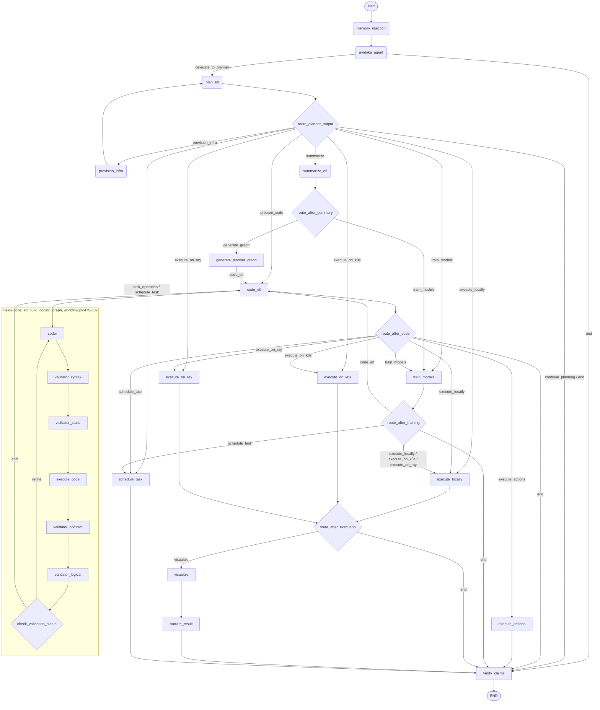

# Avaloka Architecture

Avaloka is an **agentic team of data scientists**. You describe what you want in
plain language; a group of specialized agents plans the work, samples and
profiles your data, writes and validates code, runs it locally or on a
distributed cluster, trains models, serves inference, and persists every
artifact — carrying a dataset all the way from **raw data to model inference**.

This document maps the pieces and how a request flows through them. For running
it on a cluster see [deployment.md](deployment.md); for the HTTP surface see
[api.md](api.md); for the command line see [cli.md](cli.md).

---

## 1. The mental model

```text
        You  →  web UI (ui/)  |  CLI  |  MCP  |  REST API
                 │
                 ▼
        ┌──────────────────┐      memory_injection, then avaloka_agent:
        │  Conversational  │      answers the turn itself where it can,
        └──────────────────┘      delegates when it needs a plan
                 │  delegates
                 ▼
        ┌──────────────────┐      the "team lead": converses, decides the
        │  Planner         │      next action, delegates to specialists
        └──────────────────┘
                 │  orchestrates
   ┌─────────────┼───────────────────────────────────────────────┐
   ▼             ▼              ▼            ▼           ▼         ▼
 Sampling &   Coder +        Execution    Data       Model      Visualization
 Profiling    Validator      (local/Ray/  Transfer   Training   + Scheduler
              (3-layer)      k8s)         Agent      Agent
                                          (DTA)      (MTA v1/v2)
                 │
                 ▼
        Storage, MLflow, Ray Serve inference
```

Every agent shares one state object — `ETLState` (`app/graph/etl_state.py`,
156 annotated fields at the time of writing) — and the whole thing is wired
together as a **LangGraph** graph
(`app/api/workflow.py::build_graph`). The graph is what makes the "team"
coordinate: each node reads and writes the shared state, and routing functions
decide who acts next.

## 2. The agent roster

The nodes in `build_graph` are the authoritative list; this table is the roster
behind them.

| Agent | Module | Role on the team |
| ----- | ------ | ---------------- |
| **Conversational** | `app/agents/avaloka_agent/` | Classifies the turn and answers it directly when it can, delegating to the Planner only when the turn needs one. The `avaloka_agent` node routes this (§ End-to-End Workflow). |
| **Planner** | `app/agents/planner.py` | Talks to the user, runs iterative analysis, decides the next step (keep planning, provision infra, summarize, code, train, schedule, execute). |
| **Planner Graph** | `app/agents/planner_graph_agent.py` | Renders the plan as a Mermaid DAG so you can see the execution path before running. |
| **Summarizer** | `app/agents/summarizer.py` | Freezes the conversational plan into a structured JSON contract for downstream agents. |
| **Sampling** | `app/agents/sampling_agent*.py` | Quick samples and Daft-powered portfolio samples with per-column statistics. |
| **Profiling** | `app/agents/profiling_agent.py` | Semantic profiling: infers domain, ranks columns by predictive power, flags data-quality issues. |
| **Coder** | `app/agents/coder.py` | Writes a numbered pseudocode blueprint, then emits Python that adheres to it. Deterministic fallback when the LLM is offline. |
| **Validator** | `app/agents/validator.py` | Three layers — syntax, schema-aware static analysis, and a logical LLM review — gate code before execution; feedback loops back to the Coder. |
| **Execution** | `app/agents/execution_agent.py` | Runs the code locally, as a Kubernetes Job, or on a Ray cluster. |
| **Data Transfer (DTA)** | `app/agents/data_transfer_agent/` | Generates, validates, and runs Daft-based ETL for cross-format / cross-store transfers. |
| **Model Training v1 (MTA)** | `app/agents/model_training_agent.py`, `mta/` | PyTorch training, ONNX export, MLflow tracking. |
| **Model Training v2 (MTA v2)** | `app/agents/mta_v2/` | Distributed training on Ray, model registry, and inference-service deployment. |
| **Visualization** | `app/agents/visualization_agent.py` | Turns execution outputs into charts. |
| **Scheduler** | `app/agents/scheduler.py` | Periodic runs, status, results, cancellation via Celery/RedBeat. |
| **Infrastructure** | `app/agents/infra_agent.py` | Provisions Kubernetes when the plan calls for it. |
| **Result Narrator** | `app/agents/result_narrator.py` | Writes the prose a user reads from the executed result and the charts. |
| **Claim Verifier** | `app/agents/claim_verifier.py` | Checks the narrative against the evidence, deterministically. Every path through the graph ends here (§10, evidence layer). |
| **Integrity** | `app/agents/integrity_agent.py` | Screens for leakage **before** training. |
| **Evaluation** | `app/agents/evaluation_agent.py` | Cross-validation with the splitter the data requires, plus a mandatory trivial baseline. |

## 3. Request lifecycle (raw data → inference)

1. **Ingest.** A file lands via `POST /api/upload` (`app/api/server.py:1399`),
   or arrives as a cloud URI / database connection. `file_handler/` decodes the
   format — `Handler.get_connector` (`file_handler/handler.py:30-52`) has
   connectors for CSV, Excel (`xlsx`/`xls`), Parquet, Avro, JSON, XML, Delta and
   Iceberg — and a schema + sample are attached to the state.

   **The upload gate and the connector layer do not accept the same set.**
   `SUPPORTED_UPLOAD_EXTS` (`app/api/server.py:392`) is
   `{csv, tsv, json, xml, parquet, avro, orc, xls, xlsx}`. `orc` passes the gate
   and has no connector; `delta` and `iceberg` have connectors but are not
   upload extensions — they are reached as URIs. Treat `orc` upload as
   unsupported regardless of the gate accepting it.
2. **Plan.** The Planner converses with you, calling Sampling/Profiling to ground
   itself in the actual data, and proposes a plan. The Planner Graph visualizes
   it.
3. **Summarize.** The plan becomes a JSON contract.
4. **Author + validate.** The Coder writes pseudocode → Python; the Validator's
   three layers approve it or bounce it back with feedback.
5. **Route execution.** Based on `analysis_fidelity` and the plan, the router
   (`app/execution/router.py`) picks:
   - `quick_sample` → **local**
   - `portfolio_samples` → **Daft / Ray**
   - `entire_dataset` → **k8s-Ray** (via Celery)
6. **Execute.** The Execution agent runs it and captures stdout/stderr and output
   artifacts.
7. **Train (optional).** If the plan is a modeling task, MTA v1 (local PyTorch)
   or MTA v2 (distributed Ray) trains, exports, and registers the model in
   MLflow.
8. **Serve (optional).** The trained model is deployed for inference — see
   §5 on the serving path.
9. **Persist + visualize.** Generated code, outputs, and viz configs are
   background-persisted to object storage; the Visualization agent renders
   charts.

The canonical graph is the [End-to-End Workflow](#end-to-end-workflow) section
below, transcribed from `build_graph`. (`docs/diagrams/avaloka-flowchart.mermaid`
is an older hand-maintained drawing of the same thing and has drifted; the
README has no workflow diagram, so an earlier link to one here was dead.)

## 4. Deployment & execution substrate

This is the deployment surface — the ability to stand Avaloka up as a backend on
**any Kubernetes cluster, local or cloud**, and run its compute on Ray.

```text
app/infra/
  cluster_bootstrap.py   driver:  provision (create cluster) | connect (attach to Ray)
  install_k8s.py         preflight tool checks + KubeRay operator install
  cloud_provisioner.py   cluster lifecycle dispatch
  providers/             ClusterProvider abstraction behind a factory
    factory.py             local | gcp | aws | azure  (SUPPORTED_PLATFORMS)
    local_kind.py          kind (Kubernetes-in-Docker)
    gcp_gke.py             Google Kubernetes Engine
    aws_eks.py             Amazon EKS
    azure_aks.py           Azure Kubernetes Service
    base.py                run_command + the provider interface
  ray_manager.py         Ray lifecycle: KubeRay operator, RayCluster, RayService, connect
  deploy_stack.py        build/side-load images + `helm upgrade --install`
```

The provider abstraction means one bootstrap path works everywhere: `provision`
creates or reuses a cluster, installs the **KubeRay** operator, applies the
**RayCluster**, deploys the app via Helm, and stands up **Ray Serve**;
`connect` attaches to an existing Ray cluster instead. The KubeRay operator and
the Ray images are aligned on a single Ray version (see the
[version matrix](versions.md)).

All four provider keys resolve on this branch (`app/infra/providers/factory.py:7`
lists `SUPPORTED_PLATFORMS`, and `get_provider` has a branch for each). The
**public build is different**: `oss/manifest.yaml` overlays its own
`factory.py` that gates GKE/EKS/AKS behind the `cloud_provisioning` capability,
which `app/core/editions.py:118` marks `COMMERCIAL`. `local` (kind) is the
provider an open-source install gets. See [oss-branch-model.md](oss-branch-model.md).

See [deployment.md](deployment.md) for the step-by-step.

## 5. Serving / inference

Two inference paths exist in the codebase:

- **Ray Serve (`app/serve/inference.py`)** — a `RayService`
  (`deploy/helm/ray/rayservice.yaml`) hosts the Serve app at
  `avaloka-inference-serve-svc:8000` (import path `app.serve.inference:app`).
  The chart wires this as the default inference backend
  (`config.inferenceBackend: "rayserve"`, `values.yaml:715`) and the API posts
  predictions via `RAY_SERVE_URL`
  (`http://avaloka-inference-serve-svc:8000`, `values.yaml:716`).

  **It loads real models.** `_Model` materialises an ONNX artifact from
  `MODEL_URI` or from a per-request `model_uri` — `runs:/`, `models:/`,
  `mlflow-artifacts:/`, `http(s)://`, `gs://` or a local path — and runs it
  through `onnxruntime`. `MODEL_URI` in the CR is empty by default because the
  API normally supplies the selected run's URI per request. The request shape
  is `POST /` with `{"features": {...}}`, optionally `model_uri`,
  `mlflow_tracking_uri`, and `load_only: true` to warm a model without
  predicting. `GET /` reports readiness.

  When no model can be loaded the service returns a **deterministic stand-in**
  (`"backend": "deterministic-stub"`, a stable function of the inputs) rather
  than a plausible-looking fake, and `model_loaded` reports the truth on both
  paths — check it in any response (`app/serve/inference.py:1-11, 95-121`).
  This document previously described the real-model path as a roadmap item and
  the fallback as a scaffold; both were wrong, and the module docstring says so
  in as many words.

  Scaling: the shipped CR is a fixed `num_replicas: 1` Serve deployment over a
  worker group of `minReplicas: 1, maxReplicas: 3`
  (`deploy/helm/ray/rayservice.yaml:31, 64-66`). It does **not** scale to zero —
  see §10 for which path does. The images are `avaloka-ray:latest`, side-loaded
  into the cluster by `deploy_stack.py` rather than pulled from a registry.
- **MTA v2 managed inference (`app/agents/mta_v2/`)** — trains on Ray/GKE and
  deploys a containerized inference service fronted by a GCP API Gateway, driven
  from the API's `POST /api/models/{run_id}/configure-inference-service` route
  (`app/api/server.py:8564`). This path is GCP-specific and selected with
  `config.inferenceBackend: gateway`.

  Backend selection is strict in both directions
  (`app/agents/mta_v2/inference_service_manager.py:41-65`): `INFERENCE_BACKEND`
  — the env var behind the chart key — must be exactly `rayserve` or `gateway`,
  and anything else raises instead of falling through to the legacy path.
  Choosing `gateway` additionally requires `AVALOKA_ALLOW_LEGACY_GATEWAY=1`, so
  the per-run-namespace path cannot be reached by a typo.

The direction is to serve managed inference on the cloud-neutral Ray Serve
platform by default, keeping the GCP gateway path as an opt-in.

## 6. Interfaces — one core, many front doors

`app/interfaces/service.py` is the shared core: `plan_mission(intent)` compiles a
mission and produces an execution plan, and `planned_to_dict()` is the single
JSON representation every non-CLI surface returns. Three front doors call it:

- **CLI** — `python -m app.interfaces.cli.main` (`plan`, `analyze`, `viz` —
  the subparsers at `app/interfaces/cli/main.py:243-245`). A `--endpoint` sends
  the intent to a deployed API's `/api/missions/plan` instead of planning
  locally. See [cli.md](cli.md).
- **MCP server** — `python -m app.interfaces.mcp.server`, exposing
  `plan_mission`, `estimate_cost`, `describe_environment`, `inspect_intent` as
  Model Context Protocol tools.
- **REST** — the FastAPI app in `app/api/server.py`. See [api.md](api.md).

The design invariant: identical intent yields identical output across all
surfaces, so they cannot drift apart.

The **web UI** (`ui/`) is an end-user front door over the REST API — the same
backend the CLI and MCP server share. It is a TanStack Start application
(`@tanstack/react-start` 1.168, React 19, Tailwind 4, Vite 7 — see
`ui/package.json`), authenticating through Supabase. Supabase can be the hosted
service or the in-cluster deployment the chart ships
(`deploy/helm/avaloka/templates/supabase.yaml`).

## 7. Storage & services

| Concern | Implementation |
| ------- | -------------- |
| Web UI | A TanStack Start / React 19 app in `ui/`, authenticating through Supabase (hosted or the chart's in-cluster deployment). It consumes the REST API (§6). |
| Object storage | `app/core/storage.py` — cloud-agnostic `IBlobStore` over GCS / S3 |
| Session/thread state | Redis (`app/core/cache.py`, with a circuit breaker) |
| Sampling-profile cache & UI database | Supabase — the sampling profile cache (`app/agents/sampling_persistence.py`) and the database backing the web UI |
| Experiment/model tracking | MLflow (`app/agents/mta*/`) |
| Job registry | A GitHub repository — `GITHUB_JOB_REGISTRY_REPO`, defaulting to `avaloka/avaloka-job-registry` (`app/api/server.py:8837`). Skipped when no token is set. |
| Scheduling | Celery + RedBeat (`app/core/celery_app.py`) |
| Code retrieval (RAG) | Daft embeddings (`app/rag/`) seed the Coder with prior snippets |
| **Memory plane** | Four tiers, all deployed by the chart — see §7.1 |

### 7.1 The memory plane

`app/services/memory_plane.py` orchestrates four persistent tiers. They are not
interchangeable caches; each answers a different question.

| Tier | Store | Holds | Lifetime |
| --- | --- | --- | --- |
| **L1** | Redis | Session/thread working state | Session |
| **L2** | Chroma | Usage context (`layer2_usage_context`) | Persistent (PVC) |
| **L3** | Postgres | Structured session records | Persistent |
| **L4** | Milvus | Episodic memory, retrieved by vector similarity | Persistent |

`memory_injection_node` is the **entry point of the agent graph** — every turn
passes through it before the conversational agent sees the message. It returns
`memory_hints` plus `memory_context_unavailable`, and that second field is
deliberately always a boolean: an absent field reads as "no memory was needed",
which is indistinguishable from "memory could not answer". Only `True`/`False`
are honest states, and the distinction is guarded by
`tests/test_memory_plane.py`.

**L4 depends on object storage.** Milvus stores its segments in S3-compatible
object storage, and the chart points it at the MinIO it deploys
(`deploy/helm/avaloka/templates/milvus.yaml:148-172`). That makes MinIO a
dependency of the memory plane and not only of uploads — and it is the most
fragile dependency in the stack, because the images have moved registries.
`values.yaml:194-216` pins `quay.io/minio/minio` and `quay.io/minio/mc` with a
comment recording that Docker Hub stopped serving them anonymously; the `mc`
image matters as much as the server, because it runs the bucket-creation hook.
If the MinIO pod cannot pull, uploads return HTTP 500 and L4 has nowhere to
write. **Confirm the pinned images pull in your own environment before relying
on them** — replacing MinIO is proposed on `origin/feat/seaweedfs-object-storage`
and that branch is **not merged** into `develop-1.6`.

**Embedding is local.** Queries are embedded with sentence-transformers
(`all-MiniLM-L6-v2`), and the model is **baked into the API image at build time**
under `HF_HOME=/opt/hf`. Nothing is fetched at query time, which is what allows
the whole stack to run air-gapped. A retrieval takes roughly 4–6 s cold and
under a second warm; the circuit breaker (`MEMORY_CIRCUIT_BREAKER_TIMEOUT`,
default 20.0 s at `app/services/memory_plane.py:49`, set from the chart's
`memory.circuitBreakerTimeout`) must stay above that or it aborts every call.

**What the loop is for.** It carries context forward so later work has something
to build on. It is *not* claimed to make analyses measurably better — that has
not been measured. See `docs/test-reports/three-pillar-coverage.md`.

## 8. Configuration — why each dependency exists

Avaloka is a complex system because it spans the **entire** raw-data-to-inference
lifecycle: reasoning, state, storage, distributed compute, training, tracking,
serving, and observability. Each external dependency in `.env` serves one stage
of that lifecycle. This section explains **why** each is there and what happens
without it, so the configuration reads as a map of the system rather than an
opaque list. The full template is [`.env.example`](../.env.example); the exact
variable names live there.

A guiding principle (see §9): **required** dependencies are few, and most others
**degrade honestly** — the system keeps working with reduced capability and says
so, rather than failing outright.

| Lifecycle stage | Depends on | Env vars | Required? | Why it's needed / what breaks without it |
| --------------- | ---------- | -------- | --------- | ---------------------------------------- |
| **Reasoning** (the agents' "brains") | One LLM provider, selected by `INFERENCE_PROVIDER` | `OPENROUTER_API_KEY` (default provider), or `GROQ_API_KEY_PLANNING_AGENT` / `GROQ_API_KEY_CODING_AGENT` for Groq | **A key for the selected provider, yes** | Every agent builds its model through `build_chat_model` (`app/core/inference.py`). With no usable key the agents fall back to deterministic stubs — no real planning or code synthesis. See §8.1 for which provider is selected. |
| **Session & thread state** | Redis | `REDIS_URL` | **Yes (for the API)** | Uploads, threads, and inference store session state in Redis. Without it the API returns `503` on `/api/upload`, `/threads`, and inference. A circuit breaker tolerates brief hiccups. |
| **Scheduling / long jobs** | Redis (Celery broker) | `CELERY_REDIS_URL` | For scheduled/async work | The Scheduler and full-dataset (`entire_dataset`) runs dispatch through Celery/RedBeat. Without it, only synchronous execution paths run. |
| **API authentication** | Supabase JWT (ES256/RS256 via JWKS, or legacy HS256) | `SUPABASE_URL` for JWKS; `SUPABASE_JWT_SECRET` for HS256 | **Yes (for the API)** | Every non-public route validates a bearer JWT (`app/api/server.py:1066-1084`). The env var is `SUPABASE_JWT_SECRET` — *not* `JWT_SECRET`, which is only the Python name it is bound to at `server.py:322`. An empty value fails closed at startup. See [api.md](api.md). |
| **Durable artifacts** | GCS / S3 blob store | `GCS_BUCKET` (or `GCS_BUCKET_NAME`), `S3_BUCKET`, `STORAGE_BACKEND`, `GOOGLE_APPLICATION_CREDENTIALS` — `app/core/settings.py:8-14`. **Not** `AVALOKA_ASSET_BUCKET`, which appears in `.env.example` but is read by no code; see [operations.md](operations.md) | For persistence | Generated code, execution outputs, viz configs, and models are persisted here and retrieved via signed URLs. Without it, artifacts live only for the request. |
| **Distributed compute** | Ray / KubeRay | `RAY_ADDRESS`, `MTA_RAY_DASHBOARD_URL` (shared-cluster training), provider creds | For Ray/k8s execution | `portfolio_samples` and `entire_dataset` fidelity run on Ray; large jobs and MTA v2 training run on the general Ray cluster. Ray Serve remains isolated for inference. Local execution needs none of this. |
| **Model training & registry** | MLflow | `MLFLOW_*`, `DISABLE_MLFLOW` | Optional | MTA logs experiments and registers models in MLflow. Falls back to local file storage when unset. |
| **Managed inference** | GCP (GKE + API Gateway) or Ray Serve | `GCP_PROJECT_ID`, `INFERENCE_*`, `K8S_*` | For served models | Deploys trained models as an inference service. The cloud-neutral default is in-cluster Ray Serve; the GCP-gateway path needs these. |
| **Sampling cache** | Supabase | `SUPABASE_URL`, `SUPABASE_SERVICE_ROLE_KEY` | Optional | Caches full profiling results so repeated requests skip recomputation. Without it, profiles are recomputed each time. |
| **Job registry** | GitHub repo | `GITHUB_SYSTEM_TOKEN`, `GITHUB_JOB_REGISTRY_REPO` | Optional | Job definitions are pushed to a Git registry for reproducibility/audit. Skipped when unset. |
| **Customer data connections** | MCP server | `MCP_SERVER_URL` | For DB chat / DTA | The multi-tenant MCP server brokers customer database credentials for the Data Transfer Agent and database chat. |
| **Graph runtime** | LangGraph | `LANGGRAPH_API_URL` | For the graph server | Points the API at the LangGraph runtime that executes the agent graph. |
| **Observability** | LangSmith | `LANGSMITH_API_KEY`, `LANGSMITH_PROJECT` | Optional | Traces agent runs for debugging. Purely additive. |
| **Data discovery (optional sidecar)** | openclaw | `OPENCLAW_*` | Optional | An optional discovery sidecar; off by default (`OPENCLAW_ENABLED=0` — the default is read at `app/agents/avaloka_agent/openclaw_client.py:31` and set in `.env.example:175`), and the agent uses native Python discovery when disabled. |
| **Infra defaults** | — | `DEFAULT_INFRA_PLATFORM`, `DATASET_SIZE_BYTES_THRESHOLD_FOR_RAY_TRAINING` | Optional | Tunes routing decisions (which cloud, when to escalate to Ray training). |

**The short version:** to run the agents you need **one LLM provider key**
(OpenRouter by default); to run the API you also need **Redis** and
**`SUPABASE_JWT_SECRET`**. Everything else unlocks a specific capability — cloud storage,
distributed training, managed inference, caching, tracking, database
connections — and is optional until you need that stage.

### 8.1 Which provider the agents use

`INFERENCE_PROVIDER` selects it; the accepted values are `local`, `groq`,
`openai`, `openrouter`, `bedrock`, `vertex` and `azure`, with aliases
(`ollama`/`vllm` → `local`, `aws` → `bedrock`, `gcp`/`gemini` → `vertex`) in
`_PROVIDER_ALIASES` at `app/core/inference.py:77`. Precedence, most specific
first (`resolve_provider`, `app/core/inference.py:206`):

1. `AVALOKA_<AGENT>_PROVIDER` — per agent. The agent names are the `agent=`
   literals at the call sites: `PLANNER`, `CODER`, `VALIDATOR`, `SUMMARIZER`,
   `PROFILING`, `VIZ`, `MTA`.
2. `INFERENCE_PROVIDER_<ROLE>` — `PLANNING`, `CODING`, `VIZ`.
3. `INFERENCE_PROVIDER` — global.
4. Nothing set: **OpenRouter** if `OPENROUTER_API_KEY` is present, else Groq if
   a Groq key is, else OpenAI if `OPENAI_API_KEY` is, else OpenRouter —
   `_default_provider_with_a_usable_key`, `app/core/inference.py:129`.

The default changed from Groq to OpenRouter so one key reaches many model
vendors, which is the better first-run default for a self-hosted install. Groq
remains supported and is still the lowest-latency path. Two cautions:

* The **module docstring** of `app/core/inference.py` (lines 22–27 and 41–46)
  still says Groq is the default. The code does not — `_PROVIDER_ALIASES[""]`
  is `OPENROUTER` (line 82). Trust the code; the docstring is stale.
* `.env.example:25` sets `OPENROUTER_BASE_URL`, but the builder reads
  `INFERENCE_OPENROUTER_BASE_URL` (`app/core/inference.py:308`). Overriding the
  base URL needs the second name.

Models are resolved per provider rather than passed through, because a
Groq-native model id means nothing to Bedrock or Vertex. Order is
`AVALOKA_<AGENT>_MODEL_<PROVIDER>` → `INFERENCE_<PROVIDER>_MODEL_<TIER>` →
`INFERENCE_<PROVIDER>_MODEL` → a built-in default (`_resolve_model`,
`app/core/inference.py:261`). The OpenRouter defaults are deliberately the same
models the Groq path used — `openai/gpt-oss-120b` large, `openai/gpt-oss-20b`
small — so changing the default provider did not silently change the model
every published measurement was taken on.

**`tool_choice` is per provider, not per client class.** `local`, `openrouter`
and `openai` all construct the same `ChatOpenAI`, so the class cannot tell them
apart, and the two that matter need opposite values: measured, OpenRouter with
`openai/gpt-oss-120b` returned `finish_reason="error"` on `required` and worked
on `auto`, while Ollama `gemma4:e4b` returned a tool call only on `required`.
`tool_choice_for_provider` (`app/core/inference.py:177`) encodes that — `auto`
for OpenRouter, `any` for Vertex, `required` otherwise.

## 9. Design principles

- **One shared state, many specialists.** Agents coordinate through `ETLState`,
  not through direct calls to each other.
- **Lazy heavy imports.** Deployment/serving modules import Ray/torch/daft inside
  functions so they can be inspected and unit-tested without the full stack.
- **Structured shell-outs.** All infra commands go through `run_command` and
  return a uniform outcome dict.
- **Degrade honestly.** When an LLM or service is unavailable, agents fall back
  to explicit safe stubs rather than pretending to succeed.
- **Cloud-neutral where it counts.** Storage, execution, and (increasingly)
  serving are abstracted so the same workload runs on kind, GKE, EKS, or AKS.

---

## 10. Design changes — August 2026 (the 1.6 PR wave)

The sections above describe the planner/coder/validator core. Since then the
system gained three layers, each with a one-line rationale and the PR that
carried it:

### The evidence layer (#271)
`contract.py` (agents declare stage/reads/writes; undeclared writes are
dropped, a crashing agent becomes a structured failure), `integrity_agent.py`
(leakage screened **before** training), `evaluation_agent.py`
(cross-validation with the splitter the data requires, a mandatory trivial
baseline, CI-gated wins), `claim_verifier.py` (the narrative checked against
the evidence, deterministically). The Validator checks the *code*; this layer
checks the *claim*.

### Model routing and fallback (#272, #286, #287)
One table decides *which model* (`model_config.py`, env-overridable,
live-verified); one factory decides *which provider*; `model_fallback.py`
decides *what happens when the provider fails* — OpenRouter first, then a
local vLLM/Ollama tier **sized by deployment profile** (cluster: 31B-class;
laptop: 4B, stated in the logs). `scripts/ops/discover_models.py` finds new
model families from live catalogues with zero code changes and verifies tags
before suggesting pulls. Born of a real outage: Groq removed the entire Llama
line and six agents 404'd mid-analysis.

One consequence of the default moving to OpenRouter (§8.1): when OpenRouter is
the *primary*, no fallback is attached. `_with_fallback`
(`app/core/inference.py:389`) returns the model unchanged in that case, because
wrapping an OpenRouter primary in an OpenRouter backup retries an outage
against the provider that just produced it, and the wrapper changes the
returned type. So fallback is active on the Groq, local, Bedrock, Vertex and
Azure paths, and is a deliberate no-op on the default one. Pin
`INFERENCE_PROVIDER=groq` if you want the two-provider path.

### Conversational agent with optional swarm (#273/#282, from #157)
`avaloka_agent/` routes conversation before planning; swarm is resolved by
**import probe** (`app/agents/avaloka_agent/capabilities.py`) — an OSS build
without the module
degrades to no narration, and no environment variable can claim a capability
whose code is absent. That property is what the edition split
(`docs/EDITIONS.md`, `docs/INSTALL.md`) relies on.

### Inference serving lifecycle (#265)
The legacy gateway minted an `inference-service-{uuid}` namespace plus a GCP API
Gateway per model and reclaimed neither: **eighteen accumulated between
2026-04-22 and 2026-08-14**, each holding a pod, ~1 vCPU and its own
LoadBalancer. Serving now runs in **one cluster**, and the idle-reap and Spot policy live in
`app/agents/mta_v2/inference_autoscale.py` — `min_replicas` defaults to 0
(line 70), `should_scale_to_zero` (106) decides it from last activity, and
`spot_pod_overrides` (176) emits the `cloud.google.com/gke-spot` nodeSelector
and toleration. The rule this encodes: an idle inference endpoint is pure burn,
so idleness must be a state the system can reach on its own rather than a
cleanup someone remembers to run.

Two scope limits, because the sentence above is easy to over-read. The Spot
overrides are **GKE-specific** by key name, so this is not the cloud-neutral
path. And scale-to-zero applies to the **MTA v2 managed-inference** path, not to
the Ray Serve `RayService` the chart ships, which is pinned at one replica over
a one-to-three worker group (§5).

### Training integrity (#292)
Preprocessing is fitted on the **training split only** — imputation values,
one-hot vocabularies and scaler statistics — and merely *applied* to validation.
Fitting before the split is textbook target leakage: the model sees test-set
statistics and reports a score it cannot reproduce in production. Both training
paths implement it (`app/agents/mta_v2/local_trainer.py:260`
`fit_feature_preprocessing`, and
`app/agents/mta_v2/training_docker_image/ray_job.py:750`
`fit_ray_feature_preprocessing`), and both carry an explicit
unknown-category channel so a value unseen in training is represented rather
than silently dropped.

This is a class of leakage the evidence layer **cannot** catch: `integrity_agent`
inspects the DataFrame, and preprocessing-order leakage leaves no trace there —
the rows are byte-identical either way; what leaks is a statistic computed at the
wrong moment. Unit tests on both paths are the only defence, which is why they
are required rather than optional.

The two paths are separate implementations by necessity (`ray_job.py` ships
inside a Docker image and cannot import `app.*`), so their agreement on
preprocessing, split rule and metric keys is maintained deliberately and should
be asserted by test rather than assumed.

### Fallback coverage and verification (#281, #290)
Fallback is not per-agent opt-in: **twelve modules** resolve their LLM through
`model_fallback.py`, each non-OpenRouter primary paired with an OpenRouter
equivalent via `with_fallbacks()`. Eight import `attach_fallback` directly —
`app/agents/{planner,coder,validator,summarizer,profiling_agent,visualization_agent}.py`,
`app/agents/mta/task_builder.py` and `app/services/memory_plane.py`; four arrive
through a single wrap in `app/core/agent_llm.py` —
`app/agents/data_transfer_agent/daft_coder.py` and `daft_validator.py`,
`app/agents/mta_v2/agent.py` and `training_reply_classifier.py`. (Both lists are
a `grep -rl model_fallback app/` and `grep -rl agent_llm app/` away.) A
capability that covers most agents is a capability you cannot reason about
during an outage, so the coverage is the point.

Verification runs at three altitudes.

`tests/prompt_suite/` drives **245 prompt items** through the real API end to
end — upload → chat → training → inference → transfer → schedule — across four
suites: `v4` functionality F1–F13 (86), `v2` evidence-based (96), `v1` legacy
Kaggle (44), and `heavy` (19), which is opt-in and k8s-only because its
entire-dataset and ~1,900-column items materialise 200 MB–1.9 GB and will OOM a
bare API. The default selection is the 226 items outside `heavy`. Counts are in
`tests/prompt_suite/README.md` and countable from
`tests/prompt_suite/suites/*.json`.

Above it, the benchmark harness scores behaviour deterministically
(`python -m avaloka.benchmark run`; see [benchmarks.md](benchmarks.md)).

Beside both, a **live tier** exercises real providers on a schedule rather than
on every push: `tests/live/`, driven by
`.github/workflows/live-provider-weekly.yml` and
`.github/workflows/live-local-model-nightly.yml`. It is separate because it
costs money and can fail for upstream reasons that are not regressions.

The first answers *"does every capability still work?"*; the second answers
*"is the answer any good?"*; the third answers *"does the provider still behave
the way we coded against?"*.

### Cloud portability (status)
`app/infra/providers/` resolves `local | gcp | aws | azure` through one factory
(`get_provider`, `app/infra/providers/factory.py:10`), and `cloud_provisioner`,
`cluster_bootstrap`, `deploy_stack` and `ray_manager` all route through it;
`tests/k8s/test_t5_multicloud.py` covers it. **`app/agents/mta_v2/` does not.**
Model serving and training still assume GCP: `GOOGLE_CLOUD_PROJECT` is read
directly in `mta_v2/inference.py:1046`,
`mta_v2/inference_service_manager.py:353` and
`mta_v2/inference_service_image/inference.py:168` (where it is *required*), and
the whole `mta_v2/gcp/` subtree is GCP-only. So Avaloka is multi-cloud in the
provisioner and single-cloud in the serving path. Routing MTA through the same
factory is the remaining work; until then, treat AWS/Azure inference as
manual configuration.

### Measurement (1.7 line: #277, #283, #284)
A benchmark harness with plugin-discovered suites, a
(Quality, Cost, Latency, Data-Scanned) 4-tuple, resumable journals, and a
pre-flight smoke suite over five surfaces (harness/prompts/loops/graph/
models). Two field incidents shaped it: a runner type bug that scored its own
crash as 0.0 quality, and an upstream 429 that would have read as "the 4B
model fails everything" — both caught because harness faults are tagged
distinctly from task failures.

Current diagram: `docs/images/avaloka-architecture-2026-08.png`
(source: `docs/diagrams/avaloka-architecture-2026-08.mermaid` at repo root).


## 11. Design changes — September 2026 (deployment hardening)

This wave came from **driving a live Kubernetes deployment** rather than from
reading code. Every item below shipped and was invisible to the unit suite,
because each is a failure of what a user encounters rather than of what a
function returns.

### The memory plane became real

Previously the code existed and nothing ran it. Four faults were stacked behind
a single symptom — `memory_hints: None` — and each hid the next:

1. Milvus was never deployed; the chart expected one to exist elsewhere.
2. Chroma had **no persistent volume**, so every pod restart erased tier L2.
3. The Milvus MinIO credentials referenced key names the secret does not use,
   with `optional: true`, so they were silently unset and Milvus fell back to
   default credentials.
4. `MEMORY_CIRCUIT_BREAKER_TIMEOUT` was **3.0 s** against a 4–6 s retrieval, so
   the breaker aborted every call.

The chart now deploys Milvus with etcd (reusing the deployed MinIO), gives
Chroma a PVC, and ships a breaker above the real retrieval time.

### Offline operation is a first-class mode

The embedding model is baked into the image, `memory.offlineEmbeddings` defaults
to true, and `docs/INSTALL.md` documents a `--network none` verification. With a
local model server, the full stack runs with no internet at all.

### Routing corrections in the conversational layer

* `exploration` was answered from chat while holding the computed schema, so
  "what is in this dataset?" returned a request for clarification.
* `"Where should I start?"` was parsed as a SQL `WHERE` clause.
* `"train a model to predict churn"` matched `predict` before `train a model`
  on declaration order, and routed to inference.
* Sampling-mode switches never reached the planner that honours them — so the
  phrase the agent itself suggests did nothing.

Keyword matching is now longest-match rather than first-rule-wins, so
specificity decides rather than the order rules happen to be written in —
`if kw in t and len(kw) > len(best_kw)` at
`app/agents/avaloka_agent/intent_classifier.py:212`.

### Size-aware fidelity

`SMALL_THRESHOLD` was defined and never used, so everything under 1 GB was
sampled — including a 12-row file, which was then reported to the user as a
sample. Inputs at or below the small threshold are now read whole, locally.
The threshold is **100 MB** (`app/agents/avaloka_agent/execution_profile.py:20`),
and it is compared at lines 59, 100 and 116.

### Honest failure

A provider configured with an unusable key degraded silently to canned text.
`_diagnose_missing_model()`
(`app/agents/avaloka_agent/agent.py:70`) now names the missing variable and says
when a key for a *different* provider is present. The deterministic fallback remains for
the genuinely-no-model case, which is a supported way to run.

---

## End-to-End Workflow

Transcribed from `build_graph` in `app/api/workflow.py:1053-1193`. Node names
are the strings passed to `add_node`; edge labels are the keys of the routing
maps, so every arrow here is greppable in that function.



Four properties of this graph are easy to get wrong by reading the node names:

* **`memory_injection` is the entry point**, not `plan_etl`
  (`workflow.py:1097`). Every turn passes through the memory plane before the
  conversational agent sees the message — see §7.1.
* **`avaloka_agent` decides whether the planner runs at all.** `route_avaloka`
  returns `end` for conversation it can answer itself, which goes straight to
  `verify_claims` (`workflow.py:1099-1103`).
* **Execution sits *inside* the validation chain**, between layers 2 and 3:
  `coder → validator_syntax → validator_static → execute_code →
  validator_contract → validator_logical` (`workflow.py:490-503`). The contract
  check runs on the executed result, before the LLM reviewer, because a
  deterministic verdict is cheaper and more reliable than a judged one.
* **Every path ends at `verify_claims`**, which is the only edge to `END`
  (`workflow.py:1191`). There is no route that returns a narrative without the
  claim check having run.

Two nodes are conditional on an import and absent from a build that lacks the
module: `train_models` (`app/agents/model_training_agent.py`) and `profile_data`
(`app/agents/profiling_agent.py`). `profile_data` is **registered but not
wired** — nothing adds an edge to it; `server.py` calls the profiling agent
in-process instead (`workflow.py:1091-1095`). It is drawn nowhere above for
that reason.

The `.mermaid` files at the repo root (`avaloka-flowchart.mermaid`,
`avaloka-system-diagram.mermaid`, `avaloka-architecture-2026-08.mermaid`) are
separate hand-maintained sources and are not generated from `build_graph`;
where they disagree with the diagram above, the code is authoritative.

## System Architecture

```mermaid
%% see docs/diagrams/avaloka-system-diagram.mermaid for the source diagram
graph TD
    subgraph "User Interface"
        A["Web UI (TanStack Start)"]
        A2[CLI]
        A3[MCP Server]
        B[FastAPI Backend]
    end

    subgraph "Agentic Workflow"
        C[LangGraph Runtime]
        MP[memory_injection]
        CA[avaloka_agent]
        D[Planner]
        E[Planner Graph]
        F[Summariser]
        G[Coder]
        H[Validator]
        I[Infrastructure]
        J[Execution]
        K[Sampling & Profiling]
        L[Scheduler]
        M[MTA v1 PyTorch/ONNX]
        M2[MTA v2 Ray/Inference]
        N[Visualization]
        O2[MCP Server]
        P2[RAG Engine]
    end

    subgraph "Execution Substrate"
        LK["kind / your own cluster<br/>(open source)"]
        O["GKE / EKS / AKS<br/>(commercial: provisioned)"]
        Q[Kubernetes Jobs]
        RC[Ray Cluster]
    end

    subgraph "Inference Service"
        IS[Inference Service Container]
        AG["Cloud API Gateway<br/>(commercial)"]
    end

    subgraph "Storage & Services"
        GS[GCS / S3 Blob Store]
        RD[Redis Cache]
        SB[Supabase]
        ML[MLflow]
        GH[GitHub Job Registry]
    end

    subgraph "Memory plane"
        L1["L1 Redis — session state"]
        L2["L2 Chroma — usage context"]
        L3["L3 Postgres — session records"]
        L4["L4 Milvus — episodic"]
        MO["MinIO (S3) — Milvus segments"]
    end

    A --> B
    A2 --> B
    A3 --> B
    B --> C
    C --> MP
    MP --> CA
    MP --> L1
    MP --> L2
    MP --> L3
    MP --> L4
    L4 --> MO
    CA --> D
    C --> D
    C --> E
    C --> F
    C --> G
    C --> H
    C --> I
    C --> J
    C --> K
    C --> L
    C --> M
    C --> M2
    C --> N
    D --> C
    F --> G
    G --> H
    I --> Q
    J --> Q
    J --> RC
    Q --> LK
    Q --> O
    RC --> LK
    RC --> O
    M2 --> IS
    IS --> AG
    IS --> RC
    B --> GS
    B --> RD
    B --> GH
    K --> SB
    M --> ML
    M2 --> ML
```



---

---

## Model Routing & Fallback

Model choice is configuration, not code:

| Concern | Where |
| --- | --- |
| *Which model* an agent asks for | `app/core/model_config.py` — `resolve("coder")` / `model_for("coder")`, env-overridable per `env_var_for(agent)`, live-verified against the provider catalogue |
| *Which provider* serves it | **OpenRouter (default)** · Groq · in-cluster vLLM/Ollama · OpenAI · Bedrock · Vertex · Azure — selected per §8.1 |
| *When the provider fails* | `app/core/model_fallback.py` — OpenRouter backup, then a **local** last resort sized by deployment profile. A no-op when OpenRouter is already the primary; see §10. |

The local tier is profile-aware: a cluster GPU serves `google/gemma-4-31b-it`
(`AVALOKA_LOCAL_MODEL_CLUSTER`, `model_fallback.py:463`); a laptop gets
`google/gemma-3-4b-it` (`AVALOKA_LOCAL_MODEL_LAPTOP`, line 468) — chosen
deliberately and stated in the logs, because a laptop serving 27B+ turns a
fallback into a hang. Detection uses `KUBERNETES_SERVICE_HOST` (kubelet-injected,
line 482); `AVALOKA_DEPLOYMENT_PROFILE` overrides. The ids a given vLLM or
Ollama install actually serves may differ from these defaults — the comment at
`model_fallback.py:453-455` says so, and overriding is the supported path. Measured on the conversational
integrity probes, a local 3.3 GB `gemma3:4b` matches the hosted 120B's
Pass@1 at interactive latency — the laptop tier is parity, not a compromise.

`scripts/ops/discover_models.py` keeps this current: it discovers new model
families from live catalogues (when gemma5 ships, it appears with zero code
changes), verifies pullable tags against the Ollama registry rather than
guessing, and sizes recommendations to the machine's memory — MoE models by
*active* parameters. `scripts/ops/verify_models.py` checks every configured
model against the provider's live catalogue, so a provider deprecating a
model is a CI failure, not a mid-analysis 404.
